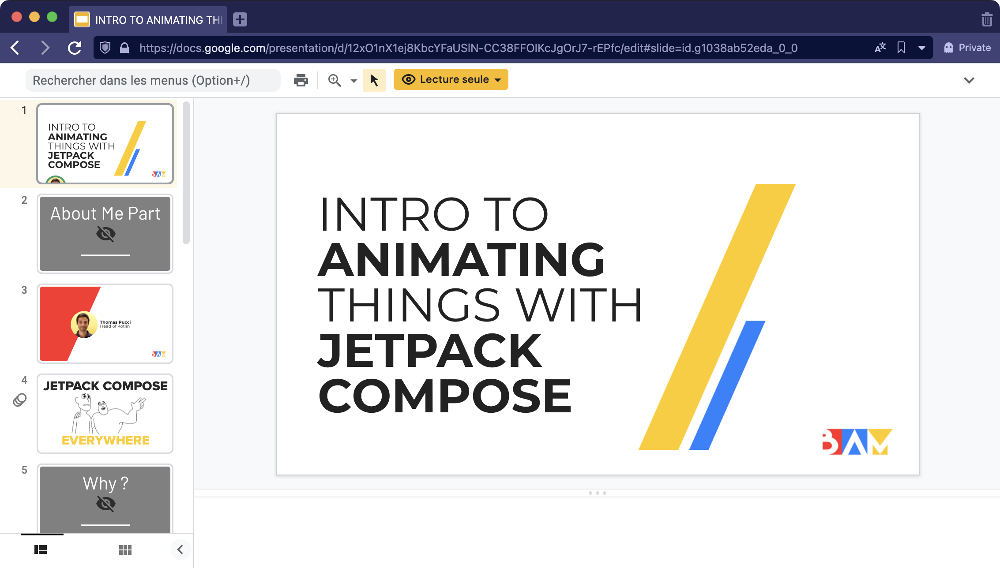

# BAM Intro to Animating Things with Jetpack Compose Android Live Coding

## What is this project ?

It is the example code for [Thomas's Pucci](https://twitter.com/Thomas_Pucci) talk about animation in Jetpack Compose.

### Screenshot

## Installation

### Prerequisites to run this project locally

- Android Studio Arctic Fox | 2020.3.1
- [ktlint](https://github.com/pinterest/ktlint)

## Slides of the presentation

[Google Presentation](https://docs.google.com/presentation/d/12xO1nX1ej8KbcYFaUSlN-CC38FFOIKcJgOrJ7-rEPfc/edit?usp=sharing)

## Links to official docs

- [Compose Animation Docs](https://developer.android.com/jetpack/compose/animation)

# About

[BAM's Website](https://bam.tech)

